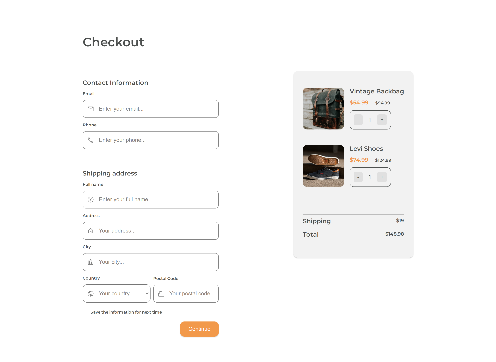

<h1 align="center">Checkout Page</h1>

  This application/site was created as a submission to <a href="https://devchallenges.io/paths/responsive-web-developer">Devchallenges</a> 

  <h3>
    <a href="">
      Demo
    </a>
     | 
    <a href="">
      Solution
    </a>
     | 
    <a href="https://devchallenges.io/challenges/0J1NxxGhOUYVqihwegfO">
      Challenge
    </a>
  </h3>

## The challenge

- User story: I can see a page following the given design
- User story: I can input email, phone, full name, address, city, country, and postal code
- User story: I can input the number of items
- User story: I can select at least 3 countries from the dropdown
- User story: When I click submit button or press enter, I can see a warning if validation fails
- User story: When I click submit button or press enter, I can see a successful alert if validation succeeds

## Built With

- CSS

## Author

- GitHub [@amansgz](https://github.com/amansgz)
- DevChallenges [@amansgz](https://devchallenges.io/portfolio/amansgz)